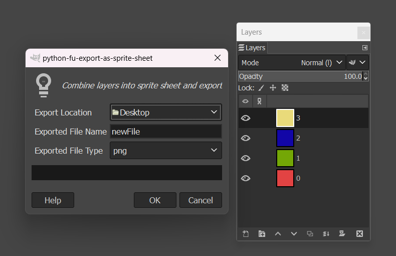
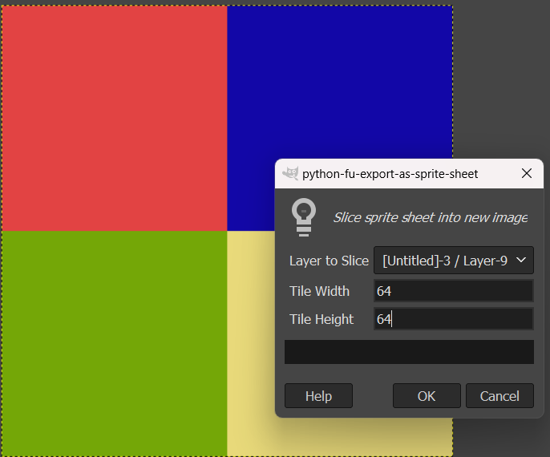
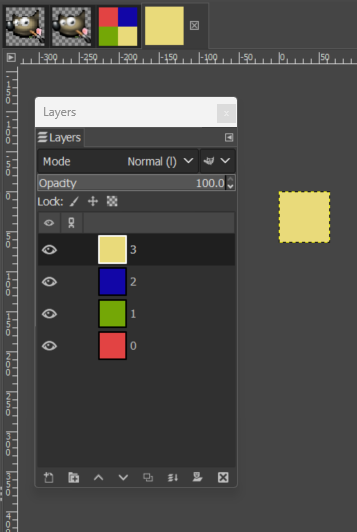
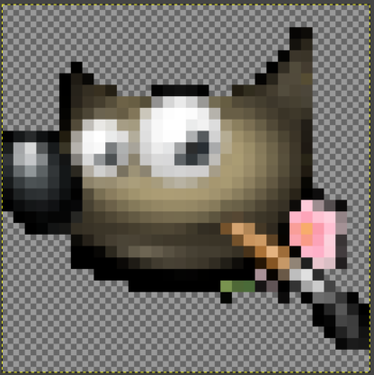
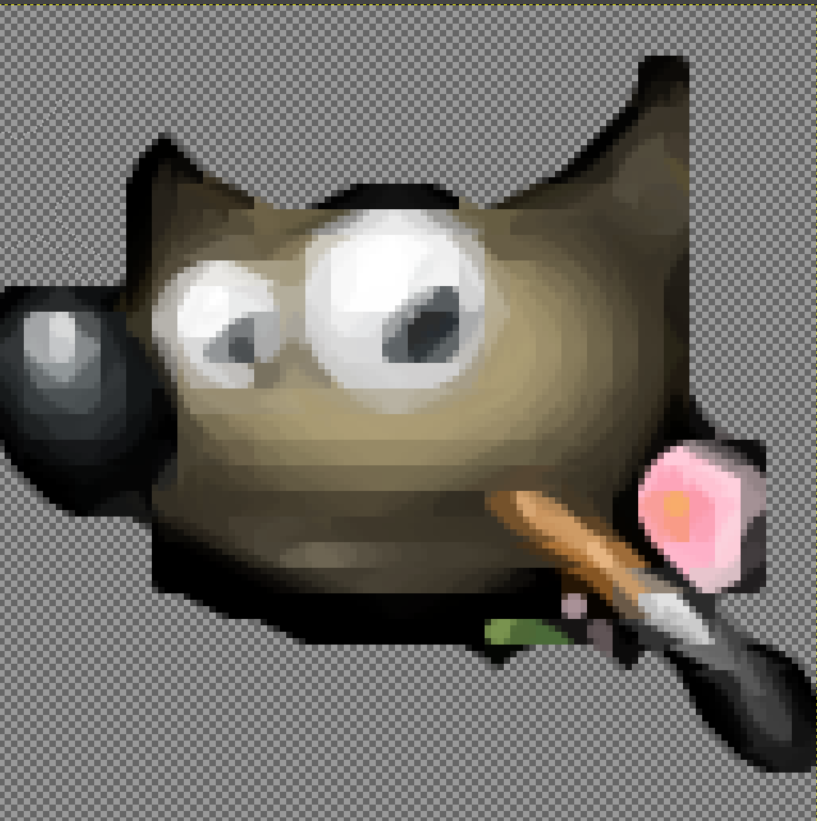

# GIMP PixelToolkit

Collection of pixel art-focused plugins for GIMP Image Editing Software.

## Adding These Plugins to GIMP

1. Clone the repo
    ```bash
    git clone https://github.com/Brody-Clark/Gimp-PixelToolkit.git
    ```
2. Build the xBRZ wrapper shared libraries
   1. Install [cmake](https://cmake.org/download/#latest) if you do not already have it.
   2. build the shared library using cmake
        ```bash
        cd xbrz_wrapper
        mkdir build
        cd build
        cmake ..
        cmake --build .
        ```
    3. Locate and copy the built library files for your platform and build configuration into the `plugins/xbrz` directory
        ```bash
        # From within the `build` directory run:
        mkdir -p ../../plugins/xbrz/    # Create an xbrz folder inside plugins/
        find -type f \( -name "*.so" -o -name "*.dll" -o -name "*.dylib" \) -exec cp {} ../../plugins/xbrz/ \;  # Copy the library file from build to plugins/xbrz/
        ```
3. Locate your GIMP plug-in directory, this can be found within GIMP under `Edit > Preferences > Folders > Plug-ins`
4. Copy all files and folders from this project's `plugins` directory to the GIMP `plug-ins` directory
5. Restart GIMP

## Included Plugins

### Sprite Sheet Exporter

- Allows you to combine all working layers of an image into a packed sprite sheet and export it to a chosen folder. Original image and layers remain unchanged.
- Located under `Image > PixelToolkit > Export As Sprite Sheet`



### Sprite Sheet Slicer

- Simple sprite sheet utility designed to divide a packed tile sheet into individual layers.
- Located under `Image > PixelToolkit > Slice Sprite Sheet`





### xBRZ Scaler

- Creates a non-destructive xBRZ-scaled image of active layer
- Located under `Image > PixelToolkit > xBRZ Scale`

32x32
  
128x128
